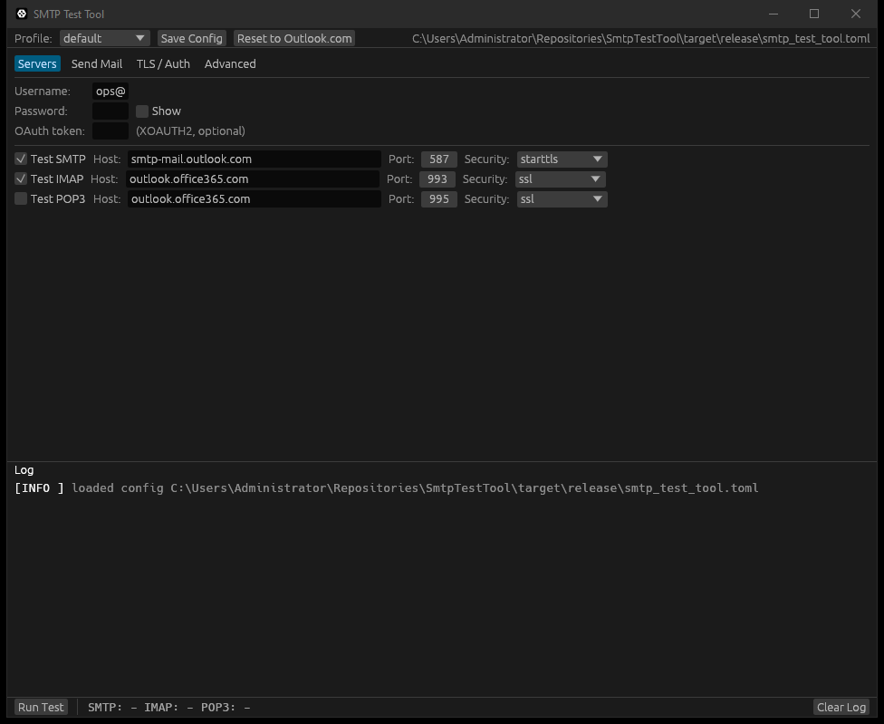
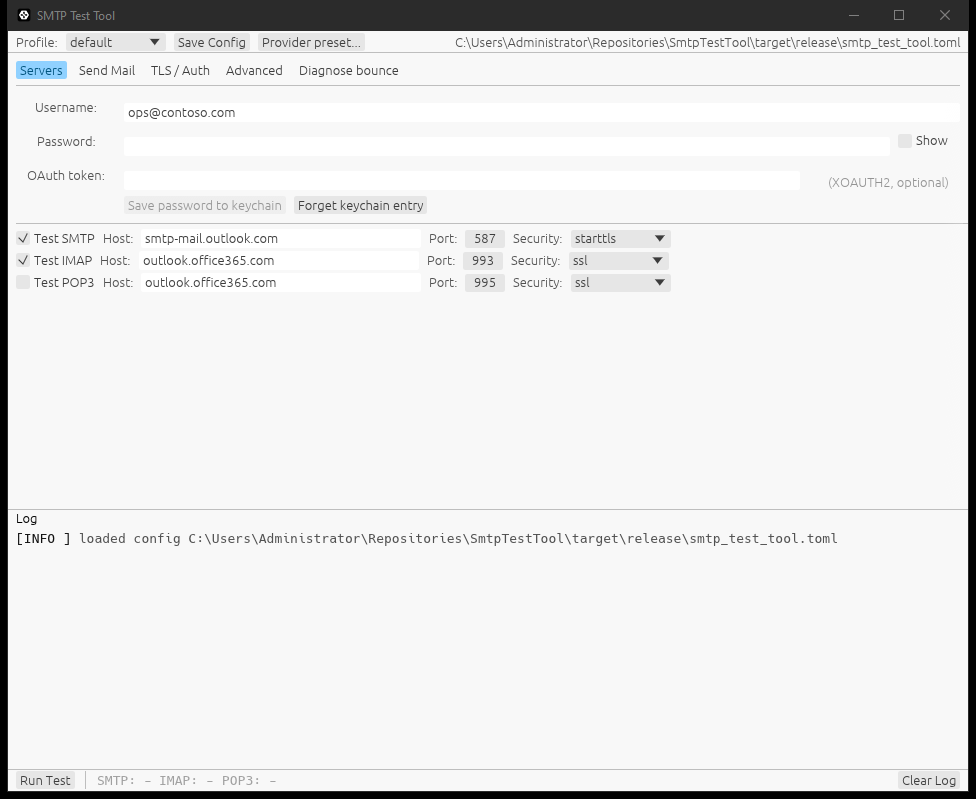
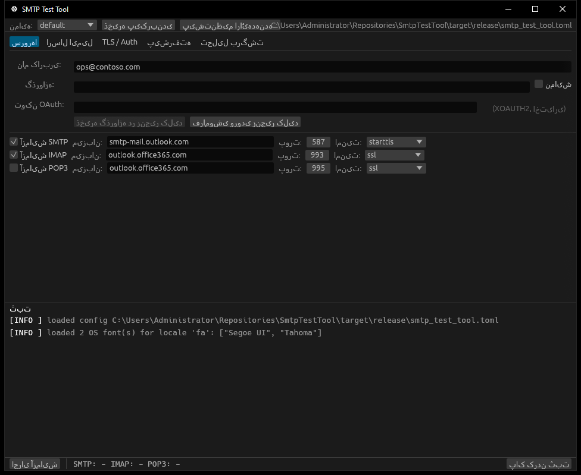
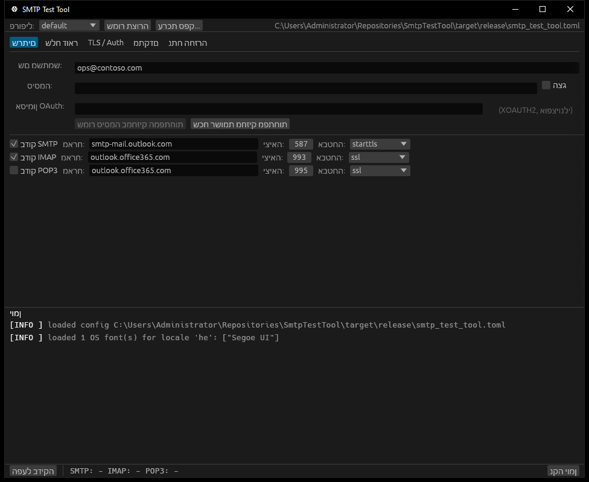
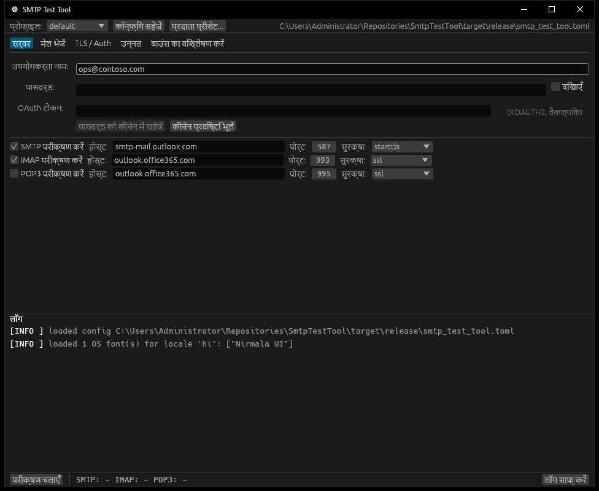
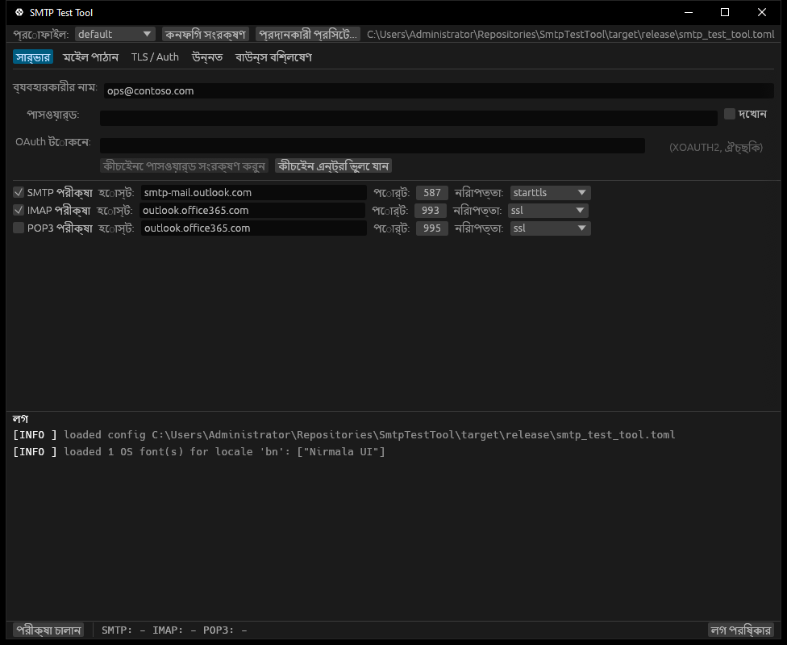
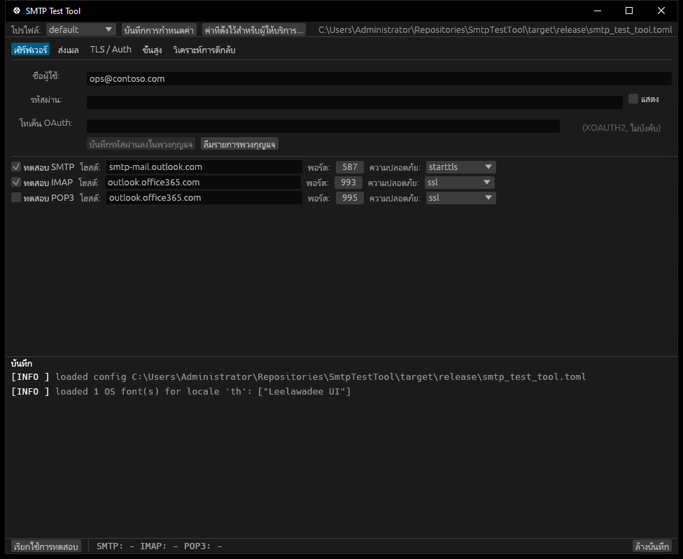

# smtp-test-tool

[](https://github.com/StruisICT/smtp-test-tool/actions/workflows/ci.yml)
[](https://github.com/StruisICT/smtp-test-tool/releases)
[](#license)
[](#building-from-source)

> Cross-platform **SMTP / IMAP / POP3** connectivity tester with
> IT-actionable diagnostics. CLI **and** GUI in one single static binary
> per OS, no external runtime, no OpenSSL on the host.

When your mail flow breaks at 09:00 on a Monday, this is the tool you
hand to your IT department alongside an exact reproduction of the error
the server returned — not "it doesn't work".

---

## Screenshots

The GUI follows the OS appearance, with a manual `auto / dark / light`
override on the Advanced tab.  Both palettes meet WCAG 2.2 Level AAA
contrast on the elements where colour carries information.

| Dark | Light |
|------|-------|
|  |  |

Non-Latin locales pick up an OS-installed font automatically (see
[Languages](#languages) for the discovery story).  Example renders:

| Chinese (`zh`) | Japanese (`ja`) | Korean *(see ko.toml)* |
|---|---|---|
|  |  | <sub>OS: Malgun Gothic</sub> |

| Arabic (`ar`) | Persian (`fa`) | Hebrew (`he`) |
|---|---|---|
|  |  |  |

| Hindi (`hi`) | Bengali (`bn`) | Thai (`th`) |
|---|---|---|
|  |  |  |

| Tamil (`ta`) | Telugu (`te`) | |
|---|---|---|
|  |  | |

## Languages

The GUI, the CLI prompts, and every diagnostic hint can be displayed
in any of the currently-shipped locales.  The application auto-
detects the OS locale on startup and applies it if a translation
exists, otherwise falls back to English.  The Advanced tab carries a
language picker limited to **your OS locale + English** — deliberately
two options at most, so the UI does not grow with the translation
set.

Shipped in v0.1.6 — **36 languages** (11 non-Latin scripts):

| Code | Native name | Status |
|------|-------------|--------|
| `en` | English | base, hand-maintained |
| `nl` | Nederlands | native quality |
| `ar` | العربية | machine-translated, native review welcome (RTL: needs system Arabic font) |
| `bg` | Български | machine-translated, native review welcome |
| `bn` | বাংলা | machine-translated, native review welcome (needs system Indic font) |
| `cs` | Čeština | machine-translated, native review welcome |
| `da` | Dansk | machine-translated, native review welcome |
| `de` | Deutsch | machine-translated, native review welcome |
| `el` | Ελληνικά | machine-translated, native review welcome |
| `es` | Español | machine-translated, native review welcome |
| `fa` | فارسی | machine-translated, native review welcome (RTL: needs system Arabic font) |
| `fi` | Suomi | machine-translated, native review welcome |
| `fr` | Français | machine-translated, native review welcome |
| `he` | עברית | machine-translated, native review welcome (RTL: needs system Hebrew font) |
| `hi` | हिन्दी | machine-translated, native review welcome (needs system Indic font) |
| `hr` | Hrvatski | machine-translated, native review welcome |
| `hu` | Magyar | machine-translated, native review welcome |
| `id` | Bahasa Indonesia | machine-translated, native review welcome |
| `it` | Italiano | machine-translated, native review welcome |
| `ja` | 日本語 | machine-translated, native review welcome (needs system CJK font) |
| `ko` | 한국어 | machine-translated, native review welcome (needs system CJK font) |
| `no` | Norsk | machine-translated, native review welcome |
| `pl` | Polski | machine-translated, native review welcome |
| `pt` | Português | machine-translated, native review welcome |
| `ro` | Română | machine-translated, native review welcome |
| `ru` | Русский | machine-translated, native review welcome |
| `sk` | Slovenčina | machine-translated, native review welcome |
| `sr` | Srpski | machine-translated, native review welcome |
| `sv` | Svenska | machine-translated, native review welcome |
| `ta` | தமிழ் | machine-translated, native review welcome (needs system Indic font) |
| `te` | తెలుగు | machine-translated, native review welcome (needs system Indic font) |
| `th` | ไทย | machine-translated, native review welcome (needs system Thai font) |
| `tr` | Türkçe | machine-translated, native review welcome |
| `uk` | Українська | machine-translated, native review welcome |
| `vi` | Tiếng Việt | machine-translated, native review welcome |
| `zh` | 简体中文 | machine-translated, native review welcome (needs system CJK font) |

Latin / Cyrillic / Greek locales render with eframe's bundled
`Inter`/`Hack` fonts.  The eleven non-Latin locales (`zh`, `ja`, `ko`,
`ar`, `fa`, `he`, `hi`, `bn`, `ta`, `te`, `th`) need a system-installed
font that covers their script.  Modern Windows / macOS / Linux desktops ship
one out of the box:

| Script | Windows | macOS | Linux (Noto) |
|---|---|---|---|
| CJK Simplified | `Microsoft YaHei UI` | `PingFang SC` | `Noto Sans CJK SC` |
| Japanese | `Yu Gothic UI` | `Hiragino Sans` | `Noto Sans CJK JP` |
| Korean | `Malgun Gothic` | `Apple SD Gothic Neo` | `Noto Sans CJK KR` |
| Arabic / Persian | `Segoe UI` + `Tahoma` | `Geeza Pro` | `Noto Sans Arabic` |
| Hebrew | `Segoe UI` | `Arial Hebrew` | `Noto Sans Hebrew` |
| Indic (all scripts) | `Nirmala UI` | `Devanagari Sangam MN` | `Noto Sans Devanagari` / `Noto Sans Bengali` |
| Thai | `Leelawadee UI` | `Thonburi` | `Noto Sans Thai` |

At startup the GUI consults `fontdb` to find one and appends it to
egui's fallback chain; **nothing is bundled into the binary**.  If
your distro lacks the relevant Noto package, glyphs will render as
tofu — install `fonts-noto-cjk` / `fonts-noto-arabic` /
`fonts-noto-hebrew` / `fonts-noto` to fix.

See [`CONTRIBUTING.md` § Translations](CONTRIBUTING.md#translations)
for the native-review recipe — PRs welcome.

## Features

- **Three protocols** in one tool: SMTP (via [`lettre`]), IMAP and POP3
  (hand-rolled over [`rustls`] so we own the full wire trace).
- **IT-actionable diagnostics**: every server response is parsed and
  enriched with a human explanation. Microsoft 365's most painful codes
  (`5.7.60` SendAsDenied, `5.7.139` Basic-Auth-disabled, `5.7.57`
  unauthenticated MAIL FROM, `5.7.708` IP-reputation block, …) are
  translated to "what to ask IT to change".
- **Provider presets** for the eleven mail services people actually
  use: Outlook.com / Hotmail, Microsoft 365, Gmail / Google Workspace,
  Yahoo Mail, iCloud / Apple Mail, Proton Mail (Bridge), Fastmail,
  Zoho Mail, AOL Mail, GMX / Mail.com, and Yandex Mail — pick one
  from the *Provider preset* menu and the SMTP / IMAP / POP3 host,
  port, and security fields fill themselves in.  Each preset carries
  a small note about app-password or Bridge requirements where they
  apply.
- **Profiles** in a human-readable TOML file (`smtp_test_tool.toml`)
  auto-loaded from the executable's directory, so "verify the
  last-known-good settings still work" is one click.
- **DNS-side audit** (feature `dns`): MX / SPF / DMARC lookups, MX-host
  A/AAAA resolution, and IT-actionable hints sorted by severity
  (`Critical` / `Warning` / `Info`) — catches the ~90% of mail-flow
  failures that are actually DNS misconfiguration (missing MX, MX with
  no A record, `+all` SPF, missing or `p=none` DMARC). CLI:
  `smtp-test-tool dns <domain>` (`--json` for machines; non-zero exit
  on any Critical hint, for shell-script alerting). GUI: a **DNS check**
  tab that audits on a background thread.
- **OAuth2 device-code flow for Microsoft 365** (feature `oauth`,
  RFC 8628): mint an XOAUTH2 token without storing a password. CLI:
  `smtp-test-tool oauth-login --user <account>` prints a URL + code,
  polls until you authorise in the browser, then stores the refresh
  token in the OS keychain so later runs auto-mint a fresh access
  token. GUI: device-code login wired into the credentials block.
- **Accessibility is the baseline, not the goal.** The GUI follows the
  OS dark/light setting on Windows, macOS, and Linux; colour is never
  the only signal (every `[ PASS ]` / `[ FAIL ]` is also textual);
  contrast ≥ 7:1 (WCAG 2.2 Level AAA); AccessKit is enabled for
  screen-reader support.
- **One binary per OS**, no installer required.

[`lettre`]: https://crates.io/crates/lettre
[`rustls`]: https://crates.io/crates/rustls

---

## Install

### Windows: WinGet or Scoop

```powershell
winget install StruisICT.SmtpTestTool
```

```powershell
scoop bucket add struisict https://github.com/StruisICT/scoop-bucket
scoop install smtp-test-tool
```

### macOS / Linux: Homebrew

```sh
brew tap struisict/tap
brew install smtp-test-tool
```

The tap and Scoop bucket are auto-updated by
[`packaging/`](packaging/) on every release — so `brew upgrade` /
`scoop update` always pulls the newest version.

### Download a prebuilt binary

Grab the latest release for your OS from
[GitHub Releases](https://github.com/StruisICT/smtp-test-tool/releases).

| OS                 | File                                                 |
|--------------------|------------------------------------------------------|
| Windows (x86_64)   | `smtp-test-tool-x86_64-pc-windows-msvc.zip`          |
| macOS (Apple Silicon) | `smtp-test-tool-aarch64-apple-darwin.tar.gz`      |
| macOS (Intel)      | `smtp-test-tool-x86_64-apple-darwin.tar.gz`          |
| Linux (x86_64)     | `smtp-test-tool-x86_64-unknown-linux-gnu.tar.gz`     |

Each archive contains both `smtp-test-tool` (CLI) and
`smtp-test-tool-gui` (GUI).

**Verify your download (optional but recommended).** Every release
archive ships with a [SLSA build-provenance attestation], so you can
confirm it was built by this repository's CI and not tampered with:

```sh
gh attestation verify smtp-test-tool-x86_64-pc-windows-msvc.zip \
  --repo StruisICT/smtp-test-tool
```

[SLSA build-provenance attestation]: https://docs.github.com/actions/security-guides/using-artifact-attestations-to-establish-provenance-for-builds

### With Cargo

```sh
cargo install smtp-test-tool          # CLI + GUI
cargo install smtp-test-tool --no-default-features  # CLI only
```

---

## Usage

### CLI

```sh
# First run with built-in Outlook.com defaults
smtp-test-tool --user me@outlook.com

# Write a starter config file next to the binary
smtp-test-tool init

# Use a saved profile
smtp-test-tool --profile production

# List profiles in the loaded config file
smtp-test-tool profiles

# Verbose diagnostic trace
smtp-test-tool --log-level debug

# Audit a domain's mail DNS (MX / SPF / DMARC); --json for machines
smtp-test-tool dns example.com

# Microsoft 365 device-code login: stores a refresh token in the keychain
smtp-test-tool oauth-login --user me@contoso.com
```

The exit code is `0` if every enabled protocol passes, `1` if any
fail, `2` on an internal/configuration error — handy for monitoring
and cron.

### GUI

Double-click `smtp-test-tool-gui` (or `smtp-test-tool-gui.exe`). The
form pre-fills with Outlook.com defaults; any
`smtp_test_tool.toml` next to the binary is loaded automatically.

### Config file (`smtp_test_tool.toml`)

```toml
active = "default"

[profiles.default]
user = "me@example.com"
smtp_host = "smtp-mail.outlook.com"
smtp_port = 587
smtp_security = "starttls"
imap_host = "outlook.office365.com"
imap_port = 993
imap_security = "ssl"
pop_host = "outlook.office365.com"
pop_port = 995
pop_security = "ssl"
pop_enabled = false

[profiles.on-prem]
user = "svc-monitor@corp.local"
smtp_host = "mail.corp.local"
smtp_port = 25
smtp_security = "starttls"
imap_host = "mail.corp.local"
imap_port = 143
imap_security = "starttls"
ca_file = "/etc/ssl/corp-internal-ca.pem"
```

**Passwords and OAuth tokens are never written to the config file.**
They live in memory for the current session, or - on opt-in - in the
native **OS keychain**:

* The GUI's Servers tab has a *Save password to keychain* / *Forget
  keychain entry* button pair under the credentials block.
* The CLI exposes `--keychain-load` (look up at startup) and
  `--keychain-save` (write after a successful test), plus a
  `keychain status|forget` subcommand.
* Backed by Windows Credential Manager, macOS Keychain, or Linux
  Secret Service via `gnome-keyring` / KWallet.  Real at-rest
  encryption, gated by the OS unlock prompt - unlike base64.

Say `cargo build --no-default-features --features gui` to ship a
build without the keychain code (skips the `keyring` crate and, on
Linux, the `libdbus-1-dev` runtime dependency).

---

## Example diagnostic output

```
2026-05-19T08:04:11Z  INFO smtp  | SMTP target smtp.office365.com:587 (starttls)
2026-05-19T08:04:11Z  INFO smtp  | TCP connection established
2026-05-19T08:04:11Z  INFO smtp  | STARTTLS negotiated, TLSv1.3
2026-05-19T08:04:12Z  ERROR smtp | SMTP AUTH FAILED
2026-05-19T08:04:12Z  ERROR smtp |   Server replied 535: 5.7.139 Authentication unsuccessful, basic authentication is disabled
2026-05-19T08:04:12Z  ERROR smtp |     ESC 5.7.139: Authentication unsuccessful, the request did not meet the criteria.
2026-05-19T08:04:12Z  ERROR smtp |     -> Action: Conditional Access policy denied the login (location, device, MFA).
```

That second-to-last line is what you forward to IT.

---

## Building from source

Requires **Rust 1.92 or newer** (stable). The egui ecosystem sets this floor; building CLI-only with `--no-default-features` would in practice work on slightly older toolchains.

```sh
git clone https://github.com/StruisICT/smtp-test-tool
cd smtp-test-tool
cargo build --release
# CLI:  target/release/smtp-test-tool
# GUI:  target/release/smtp-test-tool-gui   (built when `gui` feature is on, default)
```

### Linux build dependencies (for the GUI)

```sh
sudo apt install -y \
  libxkbcommon-dev libwayland-dev \
  libxcb-render0-dev libxcb-shape0-dev libxcb-xfixes0-dev \
  libgl1-mesa-dev libegl1-mesa-dev libfontconfig-dev
```

---

## Project layout

```
src/
├── lib.rs            re-exports + Outlook defaults
├── config.rs         TOML config with named profiles
├── diagnostics.rs    server-response -> human hint translators
├── providers.rs      built-in provider presets (Outlook, Gmail, ...)
├── tls.rs            rustls ClientConfig builder
├── smtp.rs           SMTP test (lettre)
├── imap.rs           IMAP test (hand-rolled on rustls)
├── pop3.rs           POP3 test (hand-rolled on rustls)
├── dns.rs            MX / SPF / DMARC audit + hints   (feature `dns`)
├── oauth.rs          M365 device-code flow (RFC 8628) (feature `oauth`)
├── keystore.rs       OS keychain backing            (feature `keychain`)
├── i18n.rs           translation registry + key lookup
├── locale.rs         OS-locale detection
├── fonts.rs          system-font discovery for non-Latin scripts
├── theme.rs          OS dark/light follow + WCAG AAA palettes
├── runner.rs         orchestrator (run enabled protocols, summarise)
└── bin/
    ├── cli.rs        clap-based CLI
    └── gui.rs        eframe / egui GUI
```

See [`AGENTS.md`](AGENTS.md) for the working agreement every contributor
(human or AI) must follow.

---

## Contributing

Issues and PRs welcome. Read [`AGENTS.md`](AGENTS.md) and
[`CONTRIBUTING.md`](CONTRIBUTING.md) first — they encode the
non-negotiable bits (WCAG 2.2 AAA, dark+light mode, atomic conventional
commits, latest-stable deps verified against the registry).

## License

Dual-licensed under either of

* Apache License, Version 2.0 ([`LICENSE-APACHE`](LICENSE-APACHE))
* MIT license ([`LICENSE-MIT`](LICENSE-MIT))

at your option.

Unless you explicitly state otherwise, any contribution you submit for
inclusion shall be dual-licensed as above, without any additional
terms or conditions.
